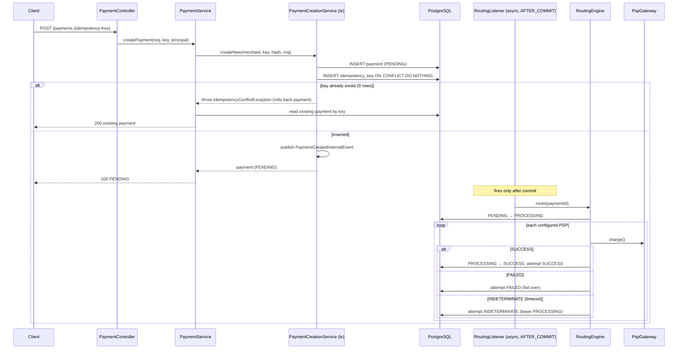

# Architecture

## Overview

The platform is a modular Spring Boot monolith. Each concern lives in its own package under
`com.app.modules.payment`, reusing shared infrastructure (`com.app.infrastructure`) and common
plumbing (`com.app.common`) — responses, exceptions, auditing.

```mermaid
flowchart TD
    Merchant([Merchant / Admin]) -->|JWT| API[PaymentController<br/>/payments]
    PSP([PSP webhook]) --> WHC[WebhookController<br/>/webhooks/&#123;psp&#125;]
    Sched([Scheduler / Admin]) --> REC[ReconciliationService]

    API --> PS[PaymentService]
    PS --> IDEM[Idempotency<br/>INSERT ... ON CONFLICT]
    PS --> PCS[PaymentCreationService<br/>payment + key in one tx]
    PCS -->|after commit, async| RE[RoutingEngine]

    RE --> SM1[PaymentStateMachine]
    RE --> PSPG[PspGateway<br/>simulated PSP_A/B/C]
    RE --> ATT[(payment_attempts)]

    WHC --> WS[WebhookService]
    WS --> LOCK[(pg_advisory_xact_lock)]
    WS --> SM2[PaymentStateMachine]

    REC --> LOCK
    REC --> VER[PspStatusVerifier]
    REC --> RLOG[(reconciliation_logs)]

    PCS --> DB[(PostgreSQL<br/>source of truth)]
    RE --> DB
    WS --> DB
    REC --> DB
    Auth[JWT filter / AuthService] -.->|blacklist| Redis[(Redis)]
```

## Request lifecycle: create payment

The key design choice: **`POST /payments` returns `PENDING` immediately**, and routing runs
**after the create transaction commits**, on a background thread. No DB transaction is ever held
across a (simulated) PSP call.

## Package layout

The `com.app.modules.payment` module is organised **by layer** (not by feature):

| Package | Contents |
|---------|----------|
| `controller` | `PaymentController`, `WebhookController`, `ReconciliationController` |
| `service` | Interfaces: `PaymentService`, `WebhookService`, `ReconciliationService`, `RoutingEngine`, `PspGateway`, `PspStatusVerifier`, `OutboxRelay` |
| `service.impl` | `PaymentServiceImpl`, `WebhookServiceImpl`, `ReconciliationServiceImpl`, `RoutingEngineImpl`, `OutboxRelayImpl`, `SimulatedPspGateway`, `SimulatedPspStatusVerifier`, plus collaborators `PaymentCreationService`, `PaymentProcessingService`, `PaymentStateMachine`, `OutboxWriter` |
| `repository` | Spring Data repositories (one per entity) |
| `entity` | `Payment`, `PaymentAttempt`, `IdempotencyKey`, `WebhookEvent`, `ReconciliationLog`, `OutboxEvent` |
| `enums` | `PaymentStatus`, `Psp`, `AttemptStatus`, `WebhookOutcome`, `PspOutcome`, `PspResultStatus`, `OutboxEventType` |
| `dto` | `CreatePaymentRequest`, `PaymentResponse`, `WebhookRequest`, `ChargeContext`, `PspChargeRequest`, `PspResult` |
| `config` | `PaymentModuleConfig`, `RoutingProperties`, `PspSimulationProperties`, `PspBehavior`, `KafkaConfig`, `ResilienceConfig` (circuit-breaker + rate-limiter registries) |
| `metrics` | `PaymentMetrics` (Micrometer counters) |
| `event` | `PaymentCreatedInternalEvent`, `PaymentRoutingListener` (after-commit async routing) |
| `scheduler` | `ReconciliationScheduler`, `OutboxScheduler` |
| `exception` | `IdempotencyConflictException` |
| `util` | `RequestHasher` |

Shared infrastructure (outside the module):

| Package | Responsibility |
|---------|----------------|
| `infrastructure.security` | JWT auth, `UserPrincipal`, filter, `AuthService`, bootstrap seeder |
| `infrastructure.lock` | `AdvisoryLockService` (transaction-scoped PostgreSQL advisory locks) |
| `infrastructure.messaging` | `EventPublisher` (wraps Spring `ApplicationEventPublisher`) |
| `infrastructure.observability` | `CorrelationIdFilter` (`X-Correlation-Id` → MDC) |
| `common` | `Response`/`BaseResponse`, `ApplicationException`, `GlobalExceptionHandler`, auditing |

## Concurrency & consistency model

| Concern | Mechanism |
|---------|-----------|
| Duplicate payments | `UNIQUE(merchant_code, idempotency_key)` + `INSERT ... ON CONFLICT DO NOTHING`; loser rolls back, fresh read returns the winner |
| Lost updates on a payment | `@Version` optimistic locking on `payments` |
| Concurrent webhooks for one payment | `pg_advisory_xact_lock(hash(reference))` — taken before read, released at commit |
| Single reconciliation run | `pg_try_advisory_xact_lock(-1)` — skip if already held |
| No transaction across PSP calls | `RoutingEngine` orchestrates; each DB mutation is a separate short tx in `PaymentProcessingService` |
| No lost domain events | Transactional outbox: `OutboxWriter` (`MANDATORY`) writes the event in the same tx as the state change; `OutboxRelay` ships to Kafka (at-least-once; dedupe on `eventId`) |
| Token revocation | Redis blacklist of JWT `jti` on logout / refresh rotation |

## Authentication & authorization

- Self-contained JWT (HMAC, jjwt). Access + refresh tokens; refresh **rotates** (old jti blacklisted).
- Principal is a single `UserPrincipal` carrying id, email, authorities, and `merchantCode`.
- Roles: `ADMIN` (sees all payments, ops endpoints) and `MERCHANT` (scoped to own `merchantCode`,
  derived from the token — never trusted from the request body).

See [DATABASE.md](DATABASE.md) for the schema and [API.md](API.md) for endpoints.
