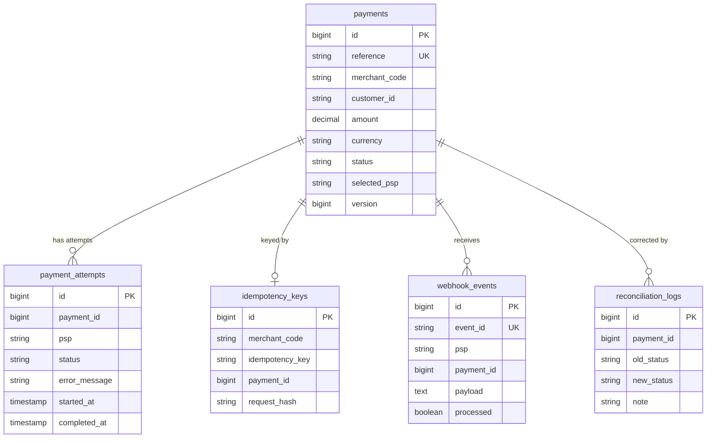

# Database Schema

PostgreSQL is the **source of truth**. Tables are generated by Hibernate
(`spring.jpa.hibernate.ddl-auto=update`); Flyway migrations are a Phase-5 item. Names use snake_case
(Spring Boot default physical naming).

## Common columns (all tables)

Every entity extends `AbstractAuditableModel`, contributing:

| Column | Type | Notes |
|--------|------|-------|
| `id` | `bigint` | PK, identity (auto-generated) |
| `created_at` | `timestamp` | Set on insert (JPA auditing) |
| `created_by` | `varchar(255)` | Auditor (user email, or `SYSTEM`) |
| `updated_at` | `timestamp` | Set on update |
| `updated_by` | `varchar(255)` | Auditor |
| `deleted_at` / `deleted_by` | `timestamp` / `varchar(255)` | Soft-delete metadata (used by `users`) |

Columns listed per-table below are the entity-specific ones (audit columns omitted for brevity).

## Payment domain (ER)

> `payment_id` references are stored as plain `bigint` (logical references, not DB foreign keys) for
> decoupling and write throughput.

### `payments`

| Column | Type | Constraints |
|--------|------|-------------|
| `reference` | `varchar(40)` | **UNIQUE** (`uk_payments_reference`), not null — external payment id, e.g. `PAY-ab12cd34ef01` |
| `merchant_code` | `varchar` | not null, indexed |
| `customer_id` | `varchar` | nullable |
| `amount` | `numeric(19,4)` | not null |
| `currency` | `varchar(3)` | not null (ISO code) |
| `status` | `varchar(20)` | not null — `CREATED`/`PENDING`/`PROCESSING`/`SUCCESS`/`FAILED`/`REFUNDED` |
| `selected_psp` | `varchar(20)` | nullable — the PSP that succeeded |
| `version` | `bigint` | `@Version` — optimistic locking |

Indexes: `idx_payments_reference`, `idx_payments_merchant`, `idx_payments_status`.

### `idempotency_keys`

| Column | Type | Constraints |
|--------|------|-------------|
| `merchant_code` | `varchar` | not null |
| `idempotency_key` | `varchar` | not null |
| `payment_id` | `bigint` | not null — the payment created for this key |
| `request_hash` | `varchar(64)` | not null — SHA-256 of merchant+amount+currency+customer; mismatch → 409 |

**UNIQUE (`merchant_code`, `idempotency_key`)** (`uk_idempotency_merchant_key`) — the sole
concurrency control guaranteeing one payment per key.

### `payment_attempts`

| Column | Type | Constraints |
|--------|------|-------------|
| `payment_id` | `bigint` | not null, indexed |
| `psp` | `varchar(20)` | not null — `PSP_A`/`PSP_B`/`PSP_C` |
| `status` | `varchar(20)` | not null — `STARTED`/`SUCCESS`/`FAILED`/`INDETERMINATE` |
| `error_message` | `varchar(500)` | nullable |
| `started_at` / `completed_at` | `timestamp` | attempt timing |

One row per PSP try, giving a full failover audit trail (e.g. PSP_A FAILED → PSP_B SUCCESS).

### `webhook_events`

| Column | Type | Constraints |
|--------|------|-------------|
| `event_id` | `varchar(200)` | **UNIQUE** (`uk_webhook_event_id`) — idempotency key for deliveries |
| `psp` | `varchar(20)` | nullable |
| `payment_id` | `bigint` | nullable (null if reference unknown), indexed |
| `payload` | `text` | raw event snapshot (JSON) |
| `processed` | `boolean` | not null — acknowledged flag |

### `reconciliation_logs`

| Column | Type | Constraints |
|--------|------|-------------|
| `payment_id` | `bigint` | not null, indexed |
| `old_status` / `new_status` | `varchar(20)` | the correction applied |
| `note` | `varchar(500)` | reason/context |

### `outbox_events`

Transactional outbox: a row is written in the **same transaction** as the payment state change it
describes, then relayed to Kafka by a scheduled poller (at-least-once; consumers dedupe on `event_id`).

| Column | Type | Constraints |
|--------|------|-------------|
| `event_id` | `varchar(64)` | **UNIQUE** (`uk_outbox_event_id`) — dedupe key for consumers |
| `aggregate_id` | `varchar` | the payment reference |
| `event_type` | `varchar(50)` | `PAYMENT_CREATED`/`PAYMENT_PROCESSING`/`PAYMENT_SUCCEEDED`/`PAYMENT_FAILED` |
| `payload` | `text` | JSON: `{eventId, paymentId, merchantId, status, timestamp}` |
| `published` | `boolean` | not null — relay flag |
| `published_at` | `timestamp` | when shipped to Kafka |

Index: `idx_outbox_published` on (`published`, `id`) for efficient batch polling.

## Auth & RBAC domain

| Table | Key columns | Notes |
|-------|-------------|-------|
| `users` | `email` UK, `username` UK, `password` (BCrypt), `merchant_code`, `status`, `provider`, `email_verified` | `merchant_code` links a user to a merchant; soft-deleted via `@SQLDelete` |
| `roles` | `slug` UK, `role_name`, `level`, `master`, `status` | e.g. `ADMIN` (level 0), `MERCHANT` (level 1) |
| `user_roles` | `user_id`, `role_id` | UNIQUE(`user_id`,`role_id`) |
| `permissions` | `slug` UK, `permission_name`, `module_id`, `status` | fine-grained authorities |
| `role_permission` | `role_id`, `permission_id` | UNIQUE(`role_id`,`permission_id`) |
| `modules` | `slug` | groups permissions |
| `pictures` | `url`, `type` | optional profile media |

